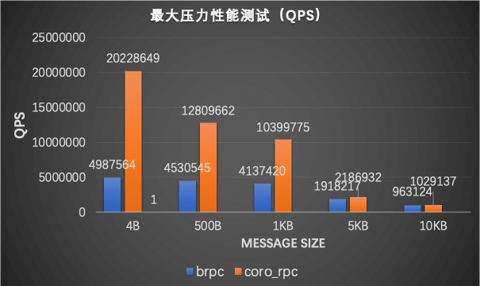
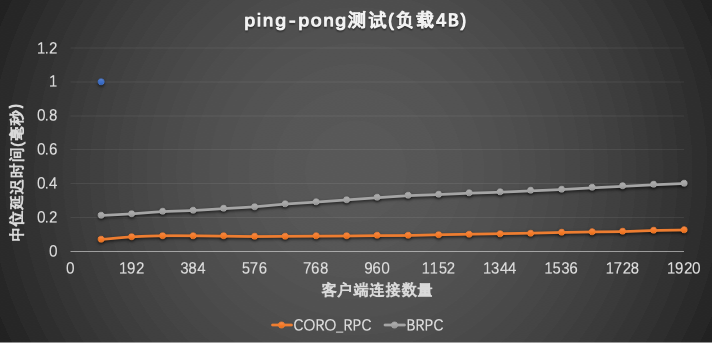
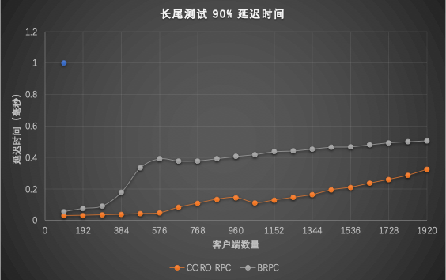

# coro_rpc简介

[TOC]

- [coro_rpc简介](#coro_rpc简介)
- [coro_rpc的易用性](#coro_rpc的易用性)
  - [rpc_server端](#rpc_server端)
  - [rpc函数支持任意参数](#rpc函数支持任意参数)
- [和grpc、brpc比较易用性](#和grpcbrpc比较易用性)
  - [rpc易用性比较](#rpc易用性比较)
  - [异步编程模型比较](#异步编程模型比较)
- [coro_rpc更多特色](#coro_rpc更多特色)
  - [同时支持实时任务和延时任务](#同时支持实时任务和延时任务)
  - [服务端同时支持协程和异步回调](#服务端同时支持协程和异步回调)
- [benchmark](#benchmark)
  - [测试环境](#测试环境)
  - [测试case](#测试case)
    - [极限qps测试](#极限qps测试)
    - [ping-pong测试](#ping-pong测试)
    - [长尾测试](#长尾测试)
  - [benchmark备注](#benchmark备注)
- [使用约束](#使用约束)

coro_rpc是用C++20开发的基于无栈协程和编译期反射的高性能的rpc库，在单机上echo测试qps达到2000万(详情见benchmark部分)
，性能远高于grpc和brpc等rpc库。然而高性能不是它的主要特色，coro_rpc的主要特色是易用性，免安装，包含头文件就可以用，几行代码就可以完成一个rpc服务器和客户端。

coro_rpc的设计理念是：以易用性为核心，回归rpc本质，让用户专注于业务逻辑而不是rpc框架细节，几行代码就可以完成rpc开发。
rpc的本质是什么？rpc的本质就是一个远程函数，除了rpc底层的网络IO之外，其它的就和普通函数一样。用户不需要关注rpc底层的网络IO、路由、序列化等细节，用户只需要专注于rpc函数的业务逻辑即可，这就是coro_rpc的设计理念,
正是基于这一设计理念，coro_rpc提供了非常简单易用的API给用户使用。通过一个例子来看看coro_rpc的易用性如何。

# coro_rpc的易用性

## rpc_server端

1.定义rpc函数

```c++
// rpc_service.hpp
inline std::string echo(std::string str) { return str; }
```

2.注册rpc函数和启动server

```c++
#include "rpc_service.hpp"
#include <coro_rpc/coro_rpc_server.hpp>

int main() {
  register_handler<echo>(); // 注册rpc函数

  coro_rpc_server server(/*thread_num =*/10, /*port =*/9000);
  server.start(); // 启动server并阻塞等待
}
```

对于rpc服务端来说，用户只需要定义rpc函数再启动server即可，不需要关注其它细节，5，6行代码就可以提供一个rpc服务了，是不是很简单！再来看看client是怎么调用hello这个rpc服务的。
rpc_client端

1. 连接服务端
2. rpc调用

```c++
#include "rpc_service.hpp"
#include <coro_rpc/coro_rpc_client.hpp>

Lazy<void> test_client() {
  coro_rpc_client client;
  co_await client.connect("localhost", /*port =*/9000);

  auto r = co_await client.call<echo>("hello coro_rpc"); //传参数调用rpc函数
  std::cout << r.result.value() << "\n"; //will print "hello coro_rpc"
}

int main() {
  syncAwait(test_client());
}
```

client调用rpc函数也同样简单，5，6行代码就可以实现rpc调用了。
就像调用本地函数一样调用远程rpc函数，在call里面输入函数名字和参数就可以实现远程调用了，非常简单。

相信上面的这个简单的例子已经充分展示了coro_rpc的易用性和特点了，也体现了rpc的本质，即用户可以像调用本地函数那样调用远程函数，用户只需要关注rpc函数的业务逻辑即可。

coro_rpc的接口易用性还体现在rpc函数几乎没有任何限制，你可以定义任意个数和任意类型参数的rpc函数, 参数的序列化和反序列化由rpc库自动完成，用户无需关心。

## rpc函数支持任意参数

```c++
// rpc_service.h
// 客户端只需要包含这个头文件即可，无需把rpc的定义暴露给客户端。
void hello(){};
int get_value(int a, int b){return a + b;}

struct person {
  int id;
  std::string name;
  int age;
};
person get_person(person p, int id);

struct dummy {
  std::string echo(std::string str) { return str; }
};

// rpc_service.cpp
#include "rpc_service.h"

int get_value(int a, int b){return a + b;}

person get_person(person p, int id) {
  p.id = id;
  return p;
}
```

server端

```c++
#include "rpc_service.h"
#include <coro_rpc/coro_rpc_server.hpp>

int main() {
  register_handler<hello, get_value, get_person>();//注册任意参数类型的普通函数

  dummy d{};
  register_handler<&dummy::echo>(&d); //注册成员函数

  coro_rpc_server server(/*thread_num =*/10, /*port =*/9000);
  server.start(); // 启动server
}
```

client端

```c++
# include "rpc_service.h"
# include <coro_rpc/coro_rpc_client.hpp>

Lazy<void> test_client() {
  coro_rpc_client client;
  co_await client.connect("localhost", /*port =*/9000);

  //RPC调用
  co_await client.call<hello>();
  co_await client.call<get_value>(1, 2);

  person p{};
  co_await client.call<get_person>(p, /*id =*/1);

  auto r = co_await client.call<&dummy::echo>("hello coro_rpc");
  std::cout << r.result.value() << "\n"; //will print "hello coro_rpc"
}

int main() {
  syncAwait(test_client());
}
```

这里面get_person函数的参数和返回值都是结构体，通过编译期反射的序列化库[struct_pack](struct_pack：一个更快更好用的序列化库.md)实现自动的序列化和反序列化，用户无感知，省心省力。

# 和grpc、brpc比较易用性

## rpc易用性比较


## 异步编程模型比较

异步回调 vs 协程
grpc异步回调

```c++
//<https://github.com/grpc/grpc/blob/master/examples/cpp/helloworld/greeter_callback_client.cc>
std::string SayHello(const std::string& user) {
    // Data we are sending to the server.
    HelloRequest request;
    request.set_name(user);

    // Container for the data we expect from the server.
    HelloReply reply;

    // Context for the client. It could be used to convey extra information to
    // the server and/or tweak certain RPC behaviors.
    ClientContext context;

    // The actual RPC.
    std::mutex mu;
    std::condition_variable cv;
    bool done = false;
    Status status;
    stub_->async()->SayHello(&context, &request, &reply,
                             [&mu, &cv, &done, &status](Status s) {
                               status = std::move(s);
                               std::lock_guard<std::mutex> lock(mu);
                               done = true;
                               cv.notify_one();
                             });

    std::unique_lock<std::mutex> lock(mu);
    while (!done) {
      cv.wait(lock);
    }

    // Act upon its status.
    if (status.ok()) {
      return reply.message();
    } else {
      std::cout << status.error_code() << ": " << status.error_message()
                << std::endl;
      return "RPC failed";
    }
  }
```

```c++
brpc异步回调
// <https://github.com/apache/incubator-brpc/blob/master/example/asynchronous_echo_c%2B%2B/client.cpp>
void HandleEchoResponse(
        brpc::Controller*cntl,
        example::EchoResponse* response) {
    // std::unique_ptr makes sure cntl/response will be deleted before returning.
    std::unique_ptr<brpc::Controller> cntl_guard(cntl);
    std::unique_ptr<example::EchoResponse> response_guard(response);

    if (cntl->Failed()) {
        LOG(WARNING) << "Fail to send EchoRequest, " << cntl->ErrorText();
        return;
    }
    LOG(INFO) << "Received response from " << cntl->remote_side()
        << ": " << response->message() << " (attached="
        << cntl->response_attachment() << ")"
        << " latency=" << cntl->latency_us() << "us";
}

int main() {
example::EchoService_Stub stub(&channel);

    // Send a request and wait for the response every 1 second.
    int log_id = 0;
    while (!brpc::IsAskedToQuit()) {
        // Since we are sending asynchronous RPC (`done' is not NULL),
        // these objects MUST remain valid until `done' is called.
        // As a result, we allocate these objects on heap
        example::EchoResponse* response = new example::EchoResponse();
        brpc::Controller* cntl = new brpc::Controller();

        // Notice that you don't have to new request, which can be modified
        // or destroyed just after stub.Echo is called.
        example::EchoRequest request;
        request.set_message("hello world");

        cntl->set_log_id(log_id ++);  // set by user
        if (FLAGS_send_attachment) {
            // Set attachment which is wired to network directly instead of 
            // being serialized into protobuf messages.
            cntl->request_attachment().append("foo");
        }

        // We use protobuf utility `NewCallback' to create a closure object
        // that will call our callback `HandleEchoResponse'. This closure
        // will automatically delete itself after being called once
        google::protobuf::Closure* done = brpc::NewCallback(
            &HandleEchoResponse, cntl, response);
        stub.Echo(cntl, &request, response, done);

        // This is an asynchronous RPC, so we can only fetch the result
        // inside the callback
        sleep(1);
    }
}
```

coro_rpc协程

```c++
# include <coro_rpc/coro_rpc_client.hpp>

Lazy<void> say_hello(){
  coro_rpc_client client;
    co_await client.connect("localhost", /*port =*/9000);
  while (true){
    auto r = co_await client.call<echo>("hello coro_rpc");
    assert(r.result.value() == "hello coro_rpc");
  }
}
```

coro_rpc的一大特色就是支持无栈协程，让用户以同步方式编写异步代码，简洁易懂！

# coro_rpc更多特色

## 同时支持实时任务和延时任务

前面展示的例子里没有看到如何将rpc函数的结果response到客户端，因为默认情况下coro_rpc框架会帮助用户自动的将rpc函数的结果自动序列化并发送到客户端，让用户完全无感知，只需要专注于业务逻辑。需要说明的是这种场景下，rpc函数的业务逻辑是在io线程中执行的，这适合对于实时性要求较高的场景下使用，缺点是会阻塞IO线程。如果用户不希望在io线程中去执行业务逻辑，而是放到线程或线程池中去执行并延迟发送消息该怎么做呢？

coro_rpc已经考虑到了这个问题，coro_rpc认为rpc任务分为实时任务和延时的任务，实时任务在io线程中执行完成后立即发送给客户端，实时性最好，延时最低；延时任务则可以放到独立线程中执行，延时处理，在未来某个时刻再将结果发送给客户端；coro_rpc同时支持这两种任务。

将之前实时任务改成延时任务

```c++
#include <coro_rpc/connection.hpp>
#include <coro_rpc/coro_rpc_server.hpp>

//实时任务，io线程中实时处理和发送结果
std::string echo(std::string str) { return str; }

//延时任务，在另外的独立线程中处理并发送结果
void delay_echo(coro_connection<std::string> conn, std::string str) {
  std::thread([conn, str]{
    conn.response_msg(str); //在独立线程中发送rpc结果
  }).detach();
}
```

## 服务端同时支持协程和异步回调

coro_rpc server推荐使用协程去开发，但同时也支持异步回调模式，用户如果不希望使用协程，则可以使用经典的异步回调模式。

基于协程的rpc server

```c++
#include <coro_rpc/coro_rpc_server.hpp>
std::string hello() { return "hello coro_rpc"; }

int main() {
  register_handler<hello, echo>();
  coro_rpc_server server(/*thread_num =*/10, /*port =*/9000);
  server.start();
}
```

基于异步回调的rpc server

```c++
#include <coro_rpc/async_rpc_server.hpp>
std::string hello() { return "hello coro_rpc"; }

int main() {
  register_handler<hello, echo>();
  async_rpc_server server(/*thread_num =*/10, /*port =*/9000);
  server.start();
}
```

rpc调用编译期安全检查
coro_rpc会在调用的时候对参数的合法性做编译期检查，比如:

```c++
inline std::string echo(std::string str) { return str; }
```

client调用rpc

```c++
client.call<echo>(42);//参数不匹配，编译报错
client.call<echo>();//缺少参数，编译报错
client.call<echo>("", 0);//多了参数，编译报错
client.call<echo>("hello, coro_rpc");//参数匹配，ok
```

# benchmark

## 测试环境

硬件：
Intel(R) Xeon(R) Platinum 8163 CPU @ 2.50GHz 96核

OS: Linux version 4.9.151-015.ali3000.alios7.x86_64

编译器：Alibaba Clang13 C++20

## 测试case

客户端和服务端都在同一台机器上，使用不同连接数发送请求做echo测试。

### 极限qps测试

1. 通过pipline发送数据和接收数据，把cpu打满后得到最高qps  


### ping-pong测试

1. 请求和响应完成之后再发下一次请求，测试该场景下的qps；
2. 测试连接数不断增多时qps的变化；
3. 测量ping-pong的平均延时  



### 长尾测试

1. 1%慢请求(异步等待50ms)下qps和延时  



## benchmark备注

1. grpc的qps始终不会超过10万，故没有放进来做性能比较；
2. 测试客户端统一用coro_rpc的压测客户端测试，压测效果较好，基本能把cpu打满。没有使用brpc测试客户端原因是：如果用brpc客户端压测，brpc的qps会降低一倍。
3. brpc由于采用了连接复用，实际上的socket连接数并没有那么多(实际连接数为96)，coro_rpc的连接数是实际的连接数。

# 使用约束

1. 目前只支持小端，兼容大端的工作正在做；
2. 目前只支持C++，暂时还不支持跨语言；编译器要求能支持C++20(clang13, gcc10.2,  msvc2022)；
3. gcc如果在O3下出现链接失败，请开启选项-fno-tree-slp-vectorize以禁用该优化选项。