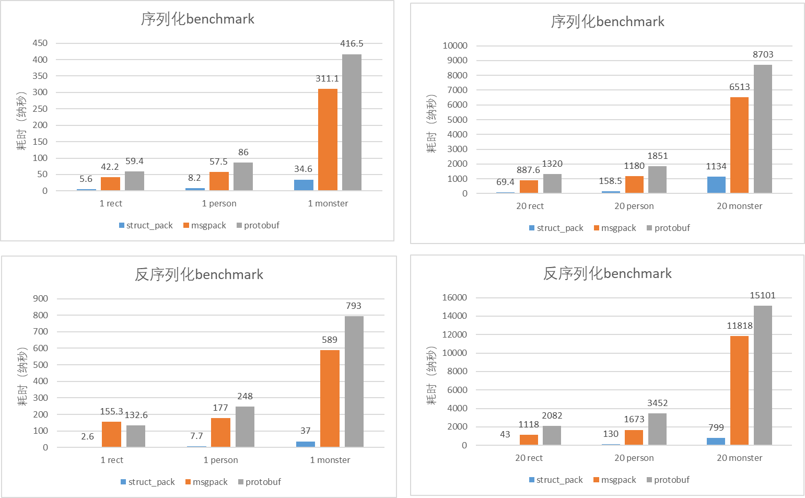

# struct_pack Introduction

struct_pack is a serialization library featuring zero-cost abstraction as well as usability. In struct_pack, the serialization or deserialization of one complex structure could easily be done in a single line of code, without any DSL, macro, or template to be defined. struct_pack supports the serialization of C++ structures through compile-time reflection and its performance is significantly better than protobuf and msgpack (see the benchmark section for details).

Below, we show the basic usage of struct_pack with a simple object as an example.

```cpp
struct person {
  int64_t id;
  std::string name;
  int age;
  double salary;
};

person person1{.id = 1, .name = "hello struct pack", .age = 20, .salary = 1024.42};
```

## Serialization

In below we demonstrate serval ways of serialize one object with struct_pack APIs.

### Basic Usage 

```cpp
// serialization in one line
std::vector<char> result = struct_pack::serialize(person1);
```

### Explicit data container

```cpp
auto result = struct_pack::serialize<std::string>(person1);
// explicitly use std::string instead of std::vector<char> to hold the result
```

### Append the result at the end of existing data container

```cpp
std::string result="The next line is struct_pack serialize result.\n";
auto result = struct_pack::serialize_to(result,person1);
// 
```

### Save the results to memory location indicated by pointer

```cpp
auto sz=struct_pack::get_needed_siarray(person1);
std::unique_ptr array=std::make_unique<char[]>(sz);
auto result = struct_pack::serialize_to(array.get(),sz,person1);
// save the result at given memory location by pointer
```

### Multi-parameter serialization

```cpp
auto result=struct_pack::serialize(person1.id, person1.name, person1.age, person1.salary);
//serialize as std::tuple<int64_t, std::string, int, double>
```

### Save the results to output stream

```cpp
std::ofstream writer("struct_pack_demo.data",
                      std::ofstream::out | std::ofstream::binary);
struct_pack::serialize_to(writer, person1);
```

## Deserialization

In below we demonstrate serval ways of deserialize one object with struct_pack APIs.

### Basic Usage

```cpp
// deserialize in one line
auto person2 = deserialize<person>(buffer);
assert(person2); // person2.has_value() == true
assert(person2.value()==person1);
```

### deserialize from pointers

```cpp
// deserialize from memory location indicated by pointers
auto person2 = deserialize<person>(buffer.data(),buffer.size());
assert(person2); //person2.has_value() == true
assert(person2.value()==person1);
```

### deserialize to an existing object

```cpp
// deserialize to an existing object
person person2;
std::errc ec = deserialize_to(person2, buffer);
assert(ec==std::errc{}); // person2.has_value() == true
assert(person2==person1);
```

### Multi-parameter deserialization

```cpp
auto person2 = deserialize<int64_t,std::string,int,double>(buffer);
assert(person2); // person2.has_value() == true
auto &&[id,name,age,salary]=person2.value();
assert(person1.id==id);
assert(person1.name==name);
assert(person1.age==age);
assert(person1.salary==salary);
```

### deserialize to input stream

```cpp
std::ifstream ifs("struct_pack_demo.data",
                  std::ofstream::in | std::ofstream::binary);
auto person2 = struct_pack::deserialize<person>(ifs);
assert(person2 == person1);
```


### Partial deserialization

Sometimes users only need to deserialize specific fields of an object instead of all of them, and that's when the partial deserialization feature can be used. This can avoid full deserialization and improve efficiency significantly, eg.:

```cpp
// Just deserialize the 2nd field of person 
auto name = get_field<person, 1>(buffer.data(), buffer.size());
assert(name); // name.has_value() == true
assert(name.value() == "hello struct pack");
```

## support std containers, std::optional and custom containers

For example, the library supports the following complicated objects with std containers and std::optional fields:

```cpp
enum class Color { red, black, white };

struct complicated_object {
  Color color;
  int a;
  std::string b;
  std::vector<person> c;
  std::list<std::string> d;
  std::deque<int> e;
  std::map<int, person> f;
  std::multimap<int, person> g;
  std::set<std::string> h;
  std::multiset<int> i;
  std::unordered_map<int, person> j;
  std::unordered_multimap<int, int> k;
  std::array<person, 2> m;
  person n[2];
  std::pair<std::string, person> o;
  std::optional<int> p;
  std::unique_ptr<int> q;
};

struct nested_object {
  int id;
  std::string name;
  person p;
  complicated_object o;
};

nested_object nested{.id = 2, .name = "tom", .p = {20, "tom"}, .o = {}};
auto buffer = serialize(nested);
auto nested2 = deserialize(buffer.data(), buffer.size());
assert(nested2)
assert(nested2==nested1);
```

## custom support

### custom type

In addition, struct_pack supports serialization and deserialization on custom containers, as below:

```cpp
// We should not inherit from stl container, this case just for testing.
template <typename Key, typename Value>
struct my_map : public std::map<Key, Value> {};

my_map<int, std::string> map1;
map1.emplace(1, "tom");
map1.emplace(2, "jerry");

absl::flat_hash_map<int, std::string> map2 =
    {{1, "huey"}, {2, "dewey"}, {3, "louie"},};

auto buffer1 = serialize(map1);
auto buffer2 = serialize(map2);
```

For more detail, See [struct_pack type system](https://alibaba.github.io/yalantinglibs/guide/struct-pack-type-system.html)

### custom output stream

Except std::ostream/std::sstream struct_pack also support serialize to custom output stream.

The custom stream should satisfy those conditions:

```cpp
template <typename T>
concept writer_t = requires(T t) {
  t.write((const char *)nullptr, std::size_t{}); // Output a piece of data. The return value can be implicit conversion to bool. Return false in any error. 
};
```

For example:

```cpp
// A simple output stream for fwrite.
struct fwrite_stream {
  FILE* file;
  bool write(const char* data, std::size_t sz) {
    return fwrite(data, sz, 1, file) == 1;
  }
  fwrite_stream(const char* file_name) : file(fopen(file_name, "wb")) {}
  ~fwrite_stream() { fclose(file); }
};
// ...
fwrite_stream writer("struct_pack_demo.data");
struct_pack::serialize_to(writer, person);
```

### custom input stream

Except std::istream/std::sstream struct_pack also support serialize to custom input stream.

The custom stream should satisfy those conditions:

```cpp
template <typename T>
concept reader_t = requires(T t) {
  t.read((char *)nullptr, std::size_t{}); // Input a piece of data. The return value can be implicit conversion to bool. Return false in any error. 
  t.ignore(std::size_t{}); // Skip a piece of data. The return value can be implicit conversion to bool. Return false in any error. 
  t.tellg(); // Return an unsigned integer as the absolute position of stream.
};
```

In addition, if the stream support `read_view`, then we enable the support of zero-copy for string_view.

```cpp
template <typename T>
concept view_reader_t = reader_t<T> && requires(T t) {
  { t.read_view(std::size_t{}) } -> std::convertible_to<const char *>;
  // Read a view from stream. The return value is the begin pointer to view. Return nullptr in any error.
};
```

## varint support

struct_pack also supports varint code for integer.

```cpp
{
  std::vector<struct_pack::var_int32_t> vec={-1,0,1,2,3,4,5,6,7};
  auto buffer = std::serialize(vec); //zigzag+varint code
}
{
  std::vector<struct_pack::uint64_t> vec={1,2,3,4,5,6,7,UINT64_MAX};
  auto buffer = std::serialize(vec); //varint code
}

```


## benchmark

### Test case

The object to be serialized is pre-initialized and the memory to store the serialization result is pre-allocated. For each test case, we run one million serializations/deserialization and take the average.

### Test objects

1. A simple object `person` with 4 scaler types

```cpp
struct person {
  int64_t id;
  std::string name;
  int age;
  double salary;
};
```

2. A complicated object `monster` with nested types

```cpp
enum Color : uint8_t { Red, Green, Blue };

struct Vec3 {
  float x;
  float y;
  float z;
};

struct Weapon {
  std::string name;
  int16_t damage;
};

struct Monster {
  Vec3 pos;
  int16_t mana;
  int16_t hp;
  std::string name;
  std::vector<uint8_t> inventory;
  Color color;
  std::vector<Weapon> weapons;
  Weapon equipped;
  std::vector<Vec3> path;
};
```

3. A `rect` object with for `int32_t`

```cpp
struct rect {
  int32_t x;
  int32_t y;
  int32_t width;
  int32_t height;
};
```

### Test Environment

Compiler: Alibaba Clang 13

Processor: (Intel(R) Xeon(R) Platinum 8163 CPU @ 2.50GHz)

### Test results



## Forward/backward compatibility

If current message type no longer meets all you needs - say, you'd like the object to have an extra field, the compatibility should not be broken so that the old object could be correctly parsed with the new type definition. In struct_pack, any new fields you added must be of type `struct_pack::compatible<T, version_number>`. <br />And the version number should be incremental each time you update the struct. Let's take struct `person` as an example:

```cpp
struct person {
  int age;
  std::string name;
};

struct person_v0 {
  int age;
  std::string name;
  struct_pack::compatible<bool> maybe; //default version number is 0
};

struct person_v1 {
  int age;
  std::string name;
  struct_pack::compatible<int32_t,20230101> id; // version number is 20230101
  struct_pack::compatible<bool> maybe; 
  struct_pack::compatible<std::string,20230101> password; // version number is 20230101
};

struct person_v2 {
  int age;
  std::string name;
  struct_pack::compatible<int32_t,20230101> id; 
  struct_pack::compatible<bool> maybe; 
  struct_pack::compatible<std::string,20230101> password;
  struct_pack::compatible<double,20230402> salary; //the version number should be incremental. So 20230402 > 20230101
};
```

struct_pack ensures that those version of struct person can be safely converted to each other by serialization and deserialization, thus achieving forward/backward compatibility.

Remember，if the version number is not incremental, struct_pack can't achieve the compatibility. Thus struct_pack skip the type check for compatible field, the convert is undefined behavior!

## Why is struct_pack faster?

1. Streamlined type information and efficient type-checking. MD5 computation is done at compile time so at runtime we only needs to compare 32bit hash values to check sameness.
2. struct_pack is a template library that encourages the compiler to do a better job at inlining.
4. Zero-cost abstraction, no runtime cost for features that are not used.
5. struct_pack's memory layout is much closer to the native C++ object, reducing the workload of (de)serializations.
6. Compile-time type calculation allows struct_pack to generate different codes according to different types. So we can do optimization upon types. For example, we could use `memcpy` on contiguous containers and zero-copy optimization could be used on `string_view`

## Appendix

### struct_pack type system

[struct_pack type system](https://alibaba.github.io/yalantinglibs/guide/struct-pack-type-system.html)

### struct_pack layout

[struct_pack layout](https://alibaba.github.io/yalantinglibs/guide/struct-pack-layout.html)


### Test code

see [benchmark.cpp](https://github.com/alibaba/yalantinglibs/tree/main/src/struct_pack/benchmark)
