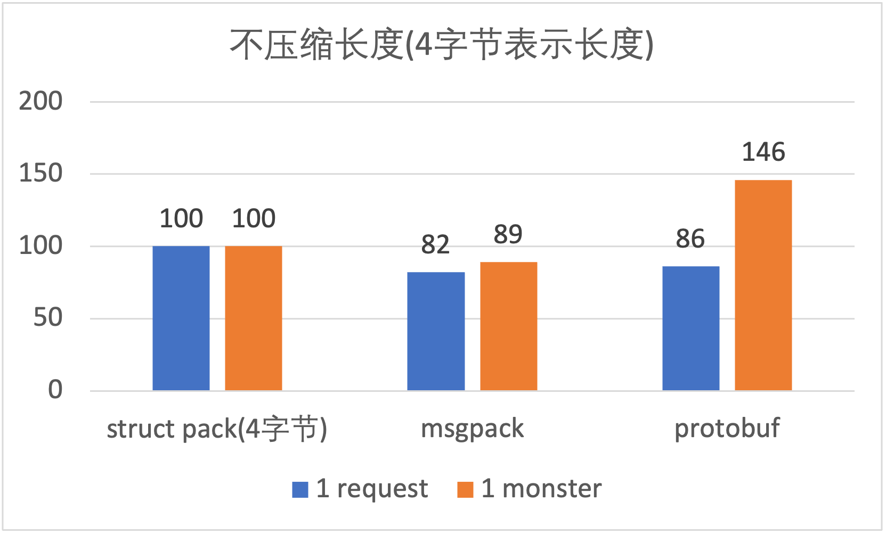
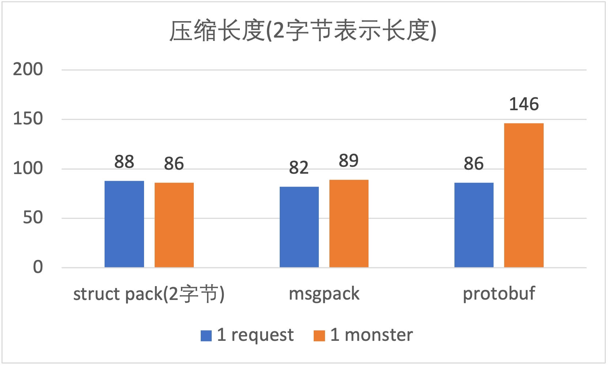
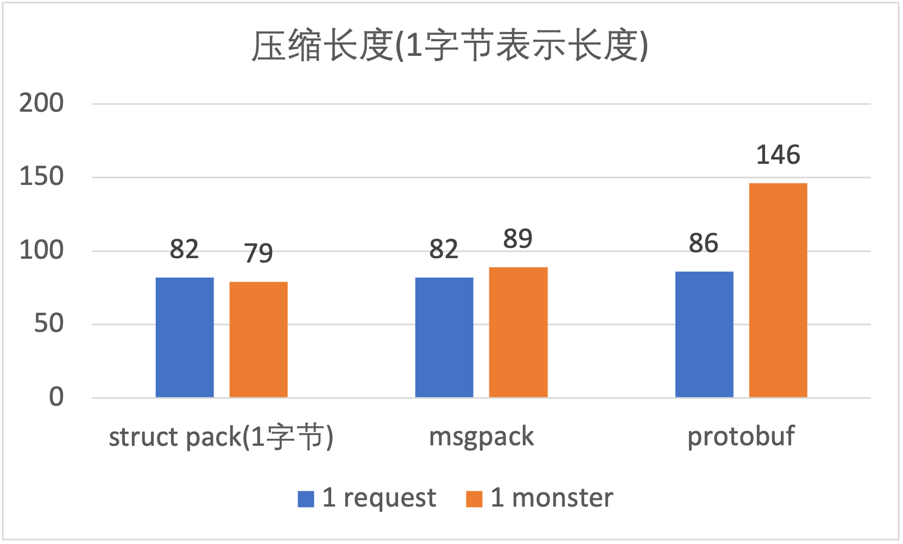

# struct_pack简介

综合性能比protobuf，msgpack大幅提升(详细可以看benchmark部分)，易用性更好，一两行代码就可以完成序列化/反序列化，此外，还支持**
部分反序列化**，它就是C++20开发的基于**编译期反射**的序列化库
struct_pack。

# 基本用法

以一个简单的对象为例展示struc_pack的基本用法。

```c++
struct person {
  int64_t id;
  std::string name;
  int age;
  double salary;
};
```

## 序列化

```c++
// 初始化一个person对象
person person1{.id = 1, .name = "hello struct pack", .age = 20, .salary = 1024.42};

// 1行代码序列化
std::vector<char> result = serialize(person1);
```

## 反序列化

```c++
person person2;
// 1行代码反序列化
auto ec = deserialize_to<person>(person2, buffer.data(), buffer.size());
assert(ec == std::errc{});
assert(p1 == p2);
```

## 部分反序列化

有时候只想反序列化对象的某个特定的字段而不是全部，这时候就可以用部分反序列化功能了，这样可以避免全部反序列化，大幅提升效率。

```c++
// 只反序列化person的第2个字段
auto [err, name] = get_field<person, 1>(buffer.data(), buffer.size());

assert(name == "hello struct pack");
```

## 支持序列化所有的STL容器、自定义容器和optional

含各种容器的对象序列化

```c++
enum class Color { red, black, white };

struct complicated_object {
  Color color;
  int a;
  std::string b;
  std::vector<person> c;
  std::list<std::string> d;
  std::deque<int> e;
  std::map<int, person> f;
  std::multimap<int, person> g;
  std::set<std::string> h;
  std::multiset<int> i;
  std::unordered_map<int, person> j;
  std::unordered_multimap<int, int> k;
  std::array<person, 2> m;
  person n[2];
  std::pair<std::string, person> o;
};

struct nested_object {
  int id;
  std::string name;
  person p;
  complicated_object o;
};

nested_object nested{.id = 2, .name = "tom", .p = {20, "tom"}, .o = {}};
auto buffer = serialize(nested);
auto [err2, len, nested1] = deserialize(buffer.data(), buffer.size());
assert(nested==nested1);
```

自定义容器的序列化

```c++
// We should not inherit from stl container, this case just for testing.
template <typename Key, typename Value>
struct my_map : public std::map<Key, Value> {};

my_map<int, std::string> map1;
map1.emplace(1, "tom");
map1.emplace(2, "jerry");

absl::flat_hash_map<int, std::string> map2 =
    {{1, "huey"}, {2, "dewey"}, {3, "louie"},};

auto buffer1 = serialize(map1);
auto buffer2 = serialize(map2);
```

optional序列化

```c++
std::optional<int> op1 = 42;
auto buf = serialize(op1);

std::optional<int> op2;
auto ec = deserialize_to(op2, buf.data(), buf.size());
```

# 易用性比较

目前C++中使用比较广泛的序列化库主要有protobuf, msgpack等库，在这里将它们和struct_pack在用法上做一个比较。

## msgpack序列化/反序列化

```c++
struct person {
  int64_t id;
  std::string name;
  int age;
  double salary;
  //需要在对象内部定义一个宏
  MSGPACK_DEFINE(id, name, age, salary);
};

//初始化对象
person a{.id = 1, .name = "hello struct pack", .age = 20, .salary = 1024.42};

//序列化
msgpack::sbuffer ss;
msgpack::pack(ss, a);

//反序列化
msgpack::unpacked unpacked;
msgpack::unpack(unpacked, ss.data(), ss.size());
person p = unpacked.get().as<person>();
```

msgpack这种方式的序列化比较简洁，缺点是带有侵入式，需要修改被序列化的对象。

## protobuf序列化/反序列化

先定义proto文件

```c++
message person {
    int64 id = 1;
    string name = 2;
    int32 age = 3;
    double salary = 4;
}
```

然后通过protoc自动生成proto.h和proto.cpp文件。

序列化/反序列化

```c++
void serialize_person(person* res, const MyTypes::person& data) {
  res->set_id(data.id);
  res->set_name(data.name);
  res->set_age(data.age);
  res->set_salary(data.salary);
}

void deserialize_person(const person& data, MyTypes::person& res) {
  res.id = data.id();
  res.name = data.name();
  res.age = data.age();
  res.salary = data.salary();
}

//初始化对象
person a{.id = 1, .name = "hello struct pack", .age = 20, .salary = 1024.42};

//序列化
std::string buf;
person pb;
serialize_person(&pb, a);
pb.SerializeToString(&buf);

//反序列化
person pb1;
pb1.ParseFromString(buf);
person p1;
deserialize_person(pb1, p1);
```

用protobuf序列化对象比较繁琐，除了要定义proto文件之外，还需要使用工具自动生成代码，最后还需要写给对象赋值代码，整个过程繁琐又容易出错(漏掉字段)。

## struct_pack序列化/反序列化

```c++
// 初始化一个person对象
person p1{.id = 1, .name = "hello struct pack", .age = 20, .salary = 1024.42};

// 1行代码序列化
auto buffer = struct_pack::serialize(p1);

// 1行代码反序列化
auto [err, p2] = struct_pack::deserialize<person>(buffer.data(), buffer.size());
```

相比msgpack没有了侵入式的宏定义，代码更简洁；<br />相比protobuf，无需手动去一个个序列化对象的字段，由struct_pack通过编译期反射自动化的去做了这些事情，简洁，安全又可靠。

# benchmark

## 测试原则

为了测试数据更准确，尽可能复用序列化器和反序列化器，尽可能复用对象避免创建新对象，以protobuf的benchmark为例：

```c++
template<typename PB>
void bench(PB &p) {
  std::string buf; 
  p.SerializeToString(&buf);

  PB des;
  des.ParseFromString(buf);

  for (int i = 0; i < 10; ++i) {
    {
      ScopedTimer timer("serialize protobuf");
      for (int j = 0; j < SAMPLES_COUNT; j++) {
        p.SerializeToString(&buf);//复用序列化后的string
      }
    }
  }

  for (int i = 0; i < 10; ++i) {
    {
      ScopedTimer timer("deserialize_to protobuf");
      for (int j = 0; j < SAMPLES_COUNT; j++) {
        des.ParseFromString(buf);
        des.Clear(); //只Clear，复用反序列化对象
      }
    }
  }
}
```

## 测试用例

为了让测试具有更广泛的代表性，分别对2个简单对象和2个复杂对象做10万次序列化/反序列化，测试两次，一次是单个对象的序列化/反序列化，一次是20个对象一起序列化/反序列化，看最终耗时。

## 测试对象

1. 含有整形、浮点型和字符串类型person对象

```c++
struct person {
  int64_t id;
  std::string name;
  int age;
  double salary;
};
```

2. 含有十几个字段包括嵌套对象的复杂对象monster

```c++
enum Color : uint8_t { Red, Green, Blue };

struct Vec3 {
  float x;
  float y;
  float z;
};

struct Weapon {
  std::string name;
  int16_t damage;
};

struct Monster {
  Vec3 pos;
  int16_t mana;
  int16_t hp;
  std::string name;
  std::vector<uint8_t> inventory;
  Color color;
  std::vector<Weapon> weapons;
  Weapon equipped;
  std::vector<Vec3> path;
};
```

3. 含有4个int32的rect对象

```c++
struct rect {
  int32_t x;
  int32_t y;
  int32_t width;
  int32_t height;
};
```

## 测试环境

Alibaba Clang/LLVM 13 C++20<br />物理服务器(Intel(R) Xeon(R) Platinum 8163 CPU @ 2.50GHz)

## benchmark result


## 序列化后buffer大小

msgpack和protobuf会对整数做压缩，比如一个32位的整数大小小于256时只用1个字节表示整形，小于65536时用2个字节表示整形，否则就用4个字节表示。虽然能减小binary的长度，但是这种整数压缩技术会降低序列化和反序列化的速度。struct_pack只对容器和string的size做了类似的处理，可以在编译期由用户去设置字符串和容器的size用几个字节表示(
1, 2, 4字节)，默认是4字节，这样做的好处是保持性能不降低的前提下减小binary的大小，因为绝大多数情况下string和容器的长度是可以预知的，所以完全可以在编译期去设置size由几个字节表示。
<br />**一个对象序列化后的buffer大小比较(单位: 字节)：**<br />







<br />**20个对象序列化后buffer大小比较：**<br />


从结果中可以看到，struct_pack即使不压缩长度，在多个对象序列化的时候序列化后的长度比protobuf要小，在不同程度压缩长度的时候，序列化后的长度越来越小，比msgpacl和protobuf都要小，和msgpack和protobuf的压缩相比，struct_pack的size压缩并不会导致序列化/反序列化的性能降低，甚至性能还会更好。

# 兼容性

当对象增加新的字段时，怎么保证兼容新旧对象的解析呢？当用户需要添加字段时，只需要在**新对象末尾**
增加新的 `struct_pack::compatible<T>` 字段即可。<br />以person对象为例：

```c++
struct person {
  int age;
  std::string name;
};

struct person1 {
  int age;
  std::string name;
  struct_pack::compatible<int32_t> id;
  struct_pack::compatible<bool> maybe;
};
```

struct_pack保证这两个类可以通过序列化和反序列化实现安全的相互转换，从而实现了向前/向后的兼容性。

# 更多特色--部分反序列化

部分反序列化的能力在某些场景下可以大幅提升性能，而目前其它的序列化库(msgpack, protobuf)
暂时还没有提供部分反序列化的接口。<br />
同时，得益于编译期反射的能力，可以在编译期获取对象字段信息，可以实现非侵入式的序列化/反序列化，不需要像msgpack需要定义一个宏，也不需要像protobuf那样定义DSL文件，使用上也更加简单。

# 为什么struct_pack更快？

**主要几个原因：**

1. 元数据保存在外部对象中，而无需保存在二进制格式中，二进制size更小，解析速度更快；
2. 编译期反射的作用，对象的字段在编译期就获取了，消除了运行期寻址的开销；
3. 编译期反射得到字段的类型和地址，可以直接从内存拷贝到字段，消除了中间结果；
4. 由于在编译期知道类型，循环迭代对象字段的时候cache miss更加友好；
5. 数据格式相比其它库对于序列化和反序列化更加高效；

编译期优化，由于在编译期就能知道对象的内存是否连续，所以可以针对连续内存的对象在序列化/反序列化时做优化。比如```std::vector<rect>```
对象是内存连续的，一次memcpy就可以完成序列化/反序列化，而不需要先遍历容器再把对象字段一个一个做序列化/反序列化，更加高效。

<br />以上几点就是struct_pack更快的原因。

# 附录

## 测试代码

请见 [benchmark.cpp](../benchmark/benchmark.cpp)
