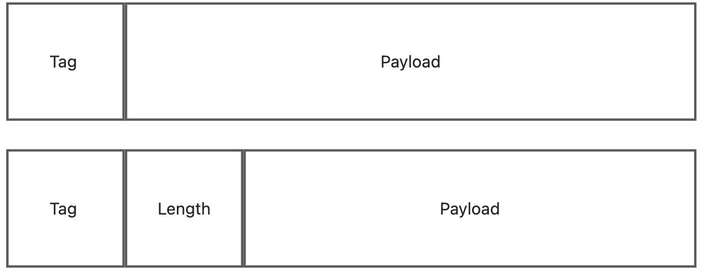
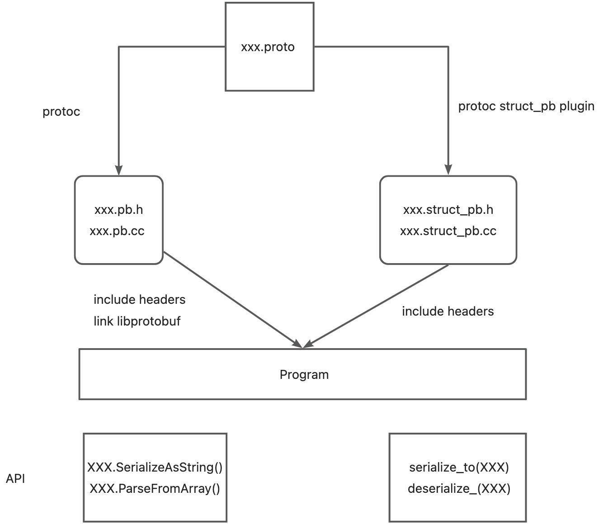

# struct_pb Introduction

## Motivation
Protocol buffers are a language-neutral, platform-neutral extensible mechanism for serializing structured data. So many programs use protobuf as their serialization library. It is convienient for our customers to use `struct_pack` if we (`struct_pack`) can compatible with protobuf binary format. That is why we create `struct_pb`.

## Background
In this section, we introduce the [protocol buffer wire format](https://developers.google.com/protocol-buffers/docs/encoding),  which defines the details of how protobuf message is sent on the wire and how much space it consumes on disk.
### Message Structure
A protocol buffer message is a series of key-value pairs. The binary version of a message just uses the field's number as the key -- the name and declared type for each field can only be determined on the decoding end by referencing the message type's definition.


```cpp
Tag = (field_number << 3) | wire_type
```


### Base 128 Varints
Variable-width integers, or _varints_, are at the core of the wire format. They allow encoding unsigned 64-bit integers using anywhere between one and ten bytes, with small values using fewer bytes.

## Design


## Type Mapping
proto3 first,
see also [Protocol Buffers Language Guide (proto3)](https://developers.google.com/protocol-buffers/docs/proto3#scalar)

### Overview
Scalar Value Types with no modifier (a.k.a **singular**) -> T

Scalar Value Types with **optional** -> `std::optional <T>`

any type with **repeat** -> `std::vector<T>`

types with **map** -> `std::map<K, V>`

any message type -> `std::optional <T>`

enum -> enum class

oneof -> `std::variant <std::monostate, ...>`


Note:

- singular.
  You cannot determine whether it was parsed from the wire. It will be serialized to the wire unless it is the default value. see also [Field Presence](https://github.com/protocolbuffers/protobuf/blob/main/docs/field_presence.md).
- optional.
  You can check to see if the value was explicitly set.
- repeat.
  In proto3, repeated fields of scalar numeric types use packed encoding by default.
- map.
  The key of map can be any integral or string type except enum.
  The value of map can be any type except another map.
- enum.
  Every enum definition must contain a constant that maps to zero as its first element.
  Enumerator constants must be in the range of a 32-bit integer.
  During deserialization, unrecognized enum values will be preserved in the message
- oneof.
  If you set an oneof field to the default value (such as setting an int32 oneof field to 0), the "case" of that oneof field will be set, and the value will be serialized on the wire.
- default value
    - For numeric types, the default is 0.
    - For enums, the default is the zero-valued enumerator.
    - For strings, bytes, and repeated fields, the default is the zero-length value.
    - For messages, the default is the language-specific null value.

### Basic
| .proto Type | struct_pb Type                    | pb native C++ type | Notes                              |
|-------------|-----------------------------------|--------------------|------------------------------------|
| double      | double                            | double             | 8 bytes                            |
| float       | float                             | float              | 4 bytes                            |
| int32       | int32                             | int32              | Uses variable-length encoding.     |
| int64       | int64                             | int64              |                                    |
| uint32      | uint32                            | uint32             |                                    |
| uint64      | uint64                            | uint64             |                                    |
| sint32      | int32                             | int32              | ZigZag + variable-length encoding. |
| sint64      | int64                             | int64              |                                    |
| fixed32     | uint32                            | uint32             | 4 bytes                            |
| fixed64     | uint64                            | uint64             | 8 bytes                            |
| sfixed32    | int32                             | int32              | 4 bytes,$2^{28}$                   |
| sfixed64    | int64                             | int64              | 8 bytes,$2^{56}$                   |
| bool        | bool                              | bool               |                                    |
| string      | std::string                       | string             | $len < 2^{32}$                     |
| bytes       | std::string                       | string             |                                    |
| enum        | enum class: int {}                | enum: int {}       |                                    |
| oneof       | std::variant<std::monostate, ...> |                    |                                    |

Note:

- for enum, we use `enum class` instead of `enum`
- for oneof, we use `std::variant` with first template argument `std::monostate`

## File Mapping
each `xxx.proto`file generates corresponding `xxx.struct_pb.h` and `xxx.struct_pb.cc`
all dependencies will convert to include corresponding headers.
```
syntax = "proto3";

import "foo.proto";

message Bar {
    Foo f = 2;
}
```
mapping to cpp
```cpp
#include "foo.struct_pb.h"
struct Bar {
std::unique_ptr<Foo> f;
};

```
## protoc Plugin
```bash
protoc --plugin=path/to/protoc-gen-structpb --structpb_out=$OUT_PATH xxx.proto
```
e.g.
```shell
protoc --plugin=/tmp/protoc-gen-structpb --structpb_out=. conformance.proto
```
## TODO

-[ ] using value instead of `std::unique_ptr` when no circle dependencies

for example, we convert the message `SearchResponse` to c++ struct `SearchResponse_v1`
```
message SearchResponse {
  Result result = 1;
}

message Result {
  string url = 1;
}
```

```cpp
struct SearchResponse_v1 {
    std::unique_ptr<Result> result;
};
```

we can optimize the pointer overhead if we can convert the message `SearchResponse` to c++ struct `SearchResponse_v2`
```cpp
struct SearchResponse_v2 {
    Result result;
};
```


## Compatibility
see also

- [Language Guide (proto3) -- Updating A Message Type](https://developers.google.com/protocol-buffers/docs/proto3#updating)
- [oneof compatibility](https://developers.google.com/protocol-buffers/docs/proto3#backwards-compatibility_issues)
## Limitation

- SGROUP(deprecated) and EGROUP(deprecated) are not support
- Reflection not support
- proto2 extension not support

## Acknowledge

- [Embedded Proto](https://embeddedproto.com/): an easy to use C++ Protocol Buffer implementation specifically suited for microcontrollers
- [protobuf-c](https://github.com/protobuf-c/protobuf-c): Protocol Buffers implementation in C
- [protozero](https://github.com/mapbox/protozero): Minimalist protocol buffer decoder and encoder in C++
- [protopuf](https://github.com/PragmaTwice/protopuf): A little, highly templated, and protobuf-compatible serialization/deserialization header-only library written in C++20

## Reference

- [Protocol Buffers Compiler Plugins](https://developers.google.com/protocol-buffers/docs/reference/other#plugins)
