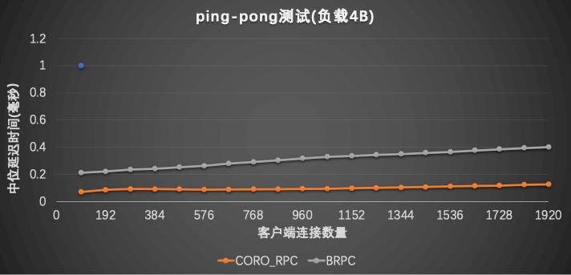
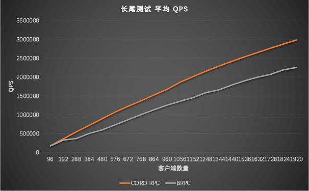

# Introduction

coro_rpc is a high-performance Remote Procedure Call (RPC) framework in C++20, based on stackless coroutine and compile-time reflection. In an `echo` benchmark test on localhost with 96-cores cpu, it reaches a peak QPS of 20 million (in pipeline) or 4.5 million(2000 connection in ping-pong), which exceeds other RPC libraries, such as grpc and brpc. Rather than high performance, the most key feature of coro_rpc is easy to use: as a header-only library, it does not need to be compiled or installed separately. It allows building an RPC client and server with a few lines of C++ code.

The core design goal of coro_rpc is usability. Instead of exposing too many troublesome details of the underlying RPC framework, coro_rpc provides a simplifying abstraction that allows programmers to concentrate principally on business logic and implement an RPC service without much effort. Given such simplicity, coro_rpc goes back to the essence of RPC: a remote function call similar to a normal function call except for the underlying network I/O. So coro_rpc user does not need to care about the underlying networking, data serialization, and so on but focus on up-layer implementations. And coro_rpc provides simple and straightforward APIs to users. Let's see one simple demo below

# Usability

## server

1. define the RPC function

```cpp
// rpc_service.hpp
inline std::string echo(std::string str) { return str; }
```
2. regist the RPC function and start the server

```cpp
#include "rpc_service.hpp"
#include <ylt/coro_rpc/coro_rpc_server.hpp>

int main() {
  coro_rpc_server server(/*thread_num =*/10, /*port =*/9000);
  server.register_handler<echo>(); // register rpc function
  server.start(); // start the server and blocking wait
}
```

Basically one could build a RPC server in 5~6 lines by defining the rpc function and starting the server, without too much details to be worried about. Now let see how a RPC client works.

An RPC client has to connect to the server and then call the remote method.

```cpp
#include "rpc_service.hpp"
#include <ylt/coro_rpc/coro_rpc_client.hpp>

Lazy<void> test_client() {
  coro_rpc_client client;
  co_await client.connect("localhost", /*port =*/"9000");

  auto r = co_await client.call<echo>("hello coro_rpc"); // call the method with parameters
  std::cout << r.result.value() << "\n"; //will print "hello coro_rpc"
}

int main() {
  syncAwait(test_client());
}
```

As demonstrated above, it is also very convenient to build a client. There's not much difference between an RPC function call with a local function one: simply provides the function name and parameters. 

The server/client implementation shows the usability and core features of coro_rpc. Also, it shows us the core concept of RPC: that users can invoke remote methods in a way with local functions, and users will focus their efforts on RPC functions.

Another usability of coro_rpc is that: there are barely any constraints on the RPC function itself. One could define an RPC function with any number of parameters. The parameters' type should be legal for struct_pack. (See [struct pack type system](https://alibaba.github.io/yalantinglibs/zh/struct_pack/struct_pack_type_system.html)). The serialization/deserialization procedures are transparent to users and the RPC framework will take care of them automatically.

## RPC with any parameters

```cpp
// rpc_service.h
// client needs to include this header and the implementation details are hidden 
void hello(){};
int get_value(int a, int b){return a + b;}

struct person {
  int id;
  std::string name;
  int age;
};
person get_person(person p, int id);

struct dummy {
  std::string echo(std::string str) { return str; }
};

// rpc_service.cpp
#include "rpc_service.h"

int get_value(int a, int b){return a + b;}

person get_person(person p, int id) {
  p.id = id;
  return p;
}
```

And in server, we define the following:

```cpp
#include "rpc_service.h"
#include <ylt/coro_rpc/coro_rpc_server.hpp>

int main() {
  coro_rpc_server server(/*thread_num =*/10, /*port =*/9000);

  server.register_handler<hello, get_value, get_person>();//register the RPC functions of any signature 

  dummy d{};
  server.register_handler<&dummy::echo>(&d); //register the member functions

  server.start(); // start the server
}
```

In client, we have the following:

```cpp
# include "rpc_service.h"
# include <coro_rpc/coro_rpc_client.hpp>

Lazy<void> test_client() {
  coro_rpc_client client;
  co_await client.connect("localhost", /*port =*/"9000");

  //RPC invokes
  co_await client.call<hello>();
  co_await client.call<get_value>(1, 2);

  person p{};
  co_await client.call<get_person>(p, /*id =*/1);

  auto r = co_await client.call<&dummy::echo>("hello coro_rpc");
  std::cout << r.result.value() << "\n"; //will print "hello coro_rpc"
}

int main() {
  syncAwait(test_client());
}
```
The input parameter and return type of `get_person` is a `struct`. The serialization/deserialization are automatically done by library [struct_pack](https://alibaba.github.io/yalantinglibs/en/struct_pack/struct_pack_intro.html) with compile-time reflection. Users are not required to take efforts on such procedures.

# Compare with grpc/brpc

## Usability

| RPC      | Define DSL | support coroutine | code lines of hello world                                                                                | external dependency | header-only |
| -------- | ---------- | ----------------- | -------------------------------------------------------------------------------------------------------- | ------------------- | ----------- |
| grpc     | Yes        | No                | 70+ [helloworld](https://github.com/grpc/grpc/tree/master/examples/cpp/helloworld)                       | 16                  | No          |
| brpc     | Yes        | No                | 40+ [helloworld](https://github.com/apache/incubator-brpc/tree/master/example/asynchronous_echo_c%2B%2B) | 6                   | No          |
| coro_rpc | No         | Yes               | 9                                                                                                        | 3                   | Yes         |

## Asynchronous Model

Asynchronous callback VS. coroutine
- grpc asynchronous client

```cpp
//<https://github.com/grpc/grpc/blob/master/examples/cpp/helloworld/greeter_callback_client.cc>
std::string SayHello(const std::string& user) {
    // Data we are sending to the server.
    HelloRequest request;
    request.set_name(user);

    // Container for the data we expect from the server.
    HelloReply reply;

    // Context for the client. It could be used to convey extra information to
    // the server and/or tweak certain RPC behaviors.
    ClientContext context;

    // The actual RPC.
    std::mutex mu;
    std::condition_variable cv;
    bool done = false;
    Status status;
    stub_->async()->SayHello(&context, &request, &reply,
                             [&mu, &cv, &done, &status](Status s) {
                               status = std::move(s);
                               std::lock_guard<std::mutex> lock(mu);
                               done = true;
                               cv.notify_one();
                             });

    std::unique_lock<std::mutex> lock(mu);
    while (!done) {
      cv.wait(lock);
    }

    // Act upon its status.
    if (status.ok()) {
      return reply.message();
    } else {
      std::cout << status.error_code() << ": " << status.error_message()
                << std::endl;
      return "RPC failed";
    }
  }
```

- brpc asynchronous client
```cpp
// <https://github.com/apache/incubator-brpc/blob/master/example/asynchronous_echo_c%2B%2B/client.cpp>
void HandleEchoResponse(
        brpc::Controller*cntl,
        example::EchoResponse* response) {
    // std::unique_ptr makes sure cntl/response will be deleted before returning.
    std::unique_ptr<brpc::Controller> cntl_guard(cntl);
    std::unique_ptr<example::EchoResponse> response_guard(response);

    if (cntl->Failed()) {
        LOG(WARNING) << "Fail to send EchoRequest, " << cntl->ErrorText();
        return;
    }
    LOG(INFO) << "Received response from " << cntl->remote_side()
        << ": " << response->message() << " (attached="
        << cntl->response_attachment() << ")"
        << " latency=" << cntl->latency_us() << "us";
}

int main() {
example::EchoService_Stub stub(&channel);

    // Send a request and wait for the response every 1 second.
    int log_id = 0;
    while (!brpc::IsAskedToQuit()) {
        // Since we are sending asynchronous RPC (`done' is not NULL),
        // these objects MUST remain valid until `done' is called.
        // As a result, we allocate these objects on heap
        example::EchoResponse* response = new example::EchoResponse();
        brpc::Controller* cntl = new brpc::Controller();

        // Notice that you don't have to new request, which can be modified
        // or destroyed just after stub.Echo is called.
        example::EchoRequest request;
        request.set_message("hello world");

        cntl->set_log_id(log_id ++);  // set by user
        if (FLAGS_send_attachment) {
            // Set attachment which is wired to network directly instead of 
            // being serialized into protobuf messages.
            cntl->request_attachment().append("foo");
        }

        // We use protobuf utility `NewCallback' to create a closure object
        // that will call our callback `HandleEchoResponse'. This closure
        // will automatically delete itself after being called once
        google::protobuf::Closure* done = brpc::NewCallback(
            &HandleEchoResponse, cntl, response);
        stub.Echo(cntl, &request, response, done);

        // This is an asynchronous RPC, so we can only fetch the result
        // inside the callback
        sleep(1);
    }
}
```

- coro_rpc client with coroutine

```cpp
# include <coro_rpc/coro_rpc_client.hpp>

Lazy<void> say_hello() {
  coro_rpc_client client;
    co_await client.connect("localhost", /*port =*/"9000");
  while (true){
    auto r = co_await client.call<echo>("hello coro_rpc");
    assert(r.result.value() == "hello coro_rpc");
  }
}
```

One core feature of coro_rpc is stackless coroutine where users could write asynchronous code in a synchronous manner, which is more simple and easy to understand.

# Benchmark

## System Configuration

Processor：Intel(R) Xeon(R) Platinum 8163 CPU @2.50GHz 96Cores

OS: Linux version 4.9.151-015.ali3000.alios7.x86_64

Compiler：Alibaba Clang13 C++20

## Test case

Both the client and server are on the same machine, sending requests using different amounts of connections to do echo tests.

### Peak QPS test

1. Send data and receive data through a pipeline, put CPU under full load and get the highest qps  


### ping-pong test

1. send the next request after the previous one is completed
2. check the QPS as the number of connections increases.
3. get the average latency of ping-pong  



### long-tail test
 



## Notes on benchmark test

1. grpc's QPS does not exceed 100,000, so it is not included in this benchmarking.
2. The client is a coro_rpc based client for both coro_rpc and brpc stress test. It has better stress test performance compared to a brpc client(With a brpc client, the brpc client will drop 50%).
3. brpc uses connection multiplexing, The actual number of socket connections is not that high(96)

# Known Limitations

1. Only little-endian is supported for now. Big-endian is working in progress
2. Only C++ is supported and could not work across languages now, will support other languages later; Compiler should support C++20(clang13, gcc10.2, msvc2022)
3. If any compile issue with `gcc -O3`, please try option `-fno-tree-slp-vectorize`
