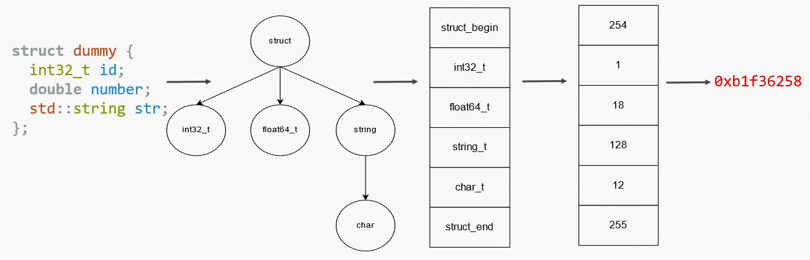

# Type system of struct_pack

`struct_pack` features a non-intrusive and complete type system. It supports structs, nested structs, various basic types and various data structures,
as well as serialization/deserialization of user-defined data structures. In the following we will introduce the type system of struct_pack.

# Serialization types supported by struct_pack

The main types supported by struct_pack are: basic types, constrained types, composite types and compatible types.

## Basic Type

Basic types are signed and unsigned fixed-length integers, floating-point numbers,
characters, boolean types, and null types. The following table lists all the basic types
supported by `struct_pack`.

| Type                      | Meaning                                   | code                                       |
| ------------------------- | ----------------------------------------- | ------------------------------------------ |
| int8_t                    | Signed fixed-length 8-bit integer         | complement code                         |
| int16_t                   | Signed fixed-length 16-bit integer        | complement code                         |
| int32_t                   | Signed fixed-length 32-bit integer        | complement code                         |
| int64_t                   | Signed fixed-length 64-bit integer        | complement code                         |
| int128_t (GCC/Clang only) | Signed fixed-length 128-bit integer        | complement code                         |
| uint8_t                   | Unsigned fixed-length 8-bit integer       | Original Code                              |
| uint16_t                  | Unsigned fixed-length 16-bit integer      | Original Code                              |
| uint32_t                  | Unsigned fixed-length 32-bit integer      | Original Code                              |
| uint64_t                  | Unsigned fixed-length 64-bit integer      | Original Code                              |
| uint128_t (GCC/Clang only)| Unsigned fixed-length 128-bit integer      | Original Code                           |
| struct_pack::var_uint32_t | Unsigned variable-length 32-bit integer   | `varint` variable length code              |
| struct_pack::var_uint64_t | Unsigned variable-length 64-bit integer   | `varint` variable length code              |
| struct_pack::var_int32_t  | Signed variable-length 32-bit integers    | `varint`+`zigzag` variable length encoding |
| struct_pack::var_int64_t  | Signed variable-length 64-bit integers    | `varint`+`zigzag` variable length encoding |
| float                     | Fixed-length 32-bit floating-point number | IEEE-754 single-precision encoding         |
| double                    | Fixed-length 64-bit floating-point number | IEEE-754 double precision encoding         |
| char8_t                   | 8-bit characters                          | Original Code                              |
| char16_t                  | 16-bit characters                         | Original Code                              |
| char32_t                  | 32-bit characters                         | Original Code                              |
| wchar_t                   | wchar characters(depends on platform)     | Original Code                              |
| bool                      | boolean                                   | Original Code                              |
| enum/enum class           | enumeration types                         | Original Code                              |
| std::monostate            | empty type                                | N/A                                        |

## constrained types

A constraint type is a specific data structure that satisfies a certain constraint. As long as the constraints are met, the data structure belongs to the same
constraint type whether it is a class provided by the standard library or a class provided by a third-party library
struct_pack supports the following constraint types.

| Type Name     | Meaning                                              | Examples                                                                                                                            |
| ------------- | ---------------------------------------------------- | ----------------------------------------------------------------------------------------------------------------------------------- |
| container     | sequential container of elements                     | std::vector, std::list, std::deque, folly::flat_vector                                                                              |
| set_container | set types of keys                                    | std::set, std::unordered_set, std::multiset, boost::container::flat_set,                                                            |
| map_container | map types of key-value pairs                         | std::map, std::unordered_map, std::multimap, boost::container::flat_map                                                             |
| string        | string                                               | std::string, std::string_view, folly::string, boost::container::string, std::wstring, std::u8string, std::u16string, std::u32string |
| array         | Array type with determined length at compile time    | C built-in array, std::array                                                                                                        |
| optional      | optional                                             | std::optional, boost::optional                                                                                                      |
| variant       | variant                                              | std::variant                                                                                                                        |
| expected      | expected, containing expected results or error codes | std::expected, tl::expected                                                                                                         |
| unique_ptr    | unique_ptr, a pointer with exclusive ownership       | std::unique_ptr                                                                                                                     |

We will demonstrate the constraints for each type so that users could define data structures of their own based on such constraints. 

### container

`value_type`, `size()`, `begin()` and `end()` member functions should exist for this type and meanwhile it should not satisfy constraints of `set_container`, `map_container` nor `string`. `value_type` must be valid `struct_pack` type.

```cpp
template <typename Type>
concept container = requires(Type container) {
  typename std::remove_cvref_t<Type>::value_type;
  container.size();
  container.begin();
  container.end();
} && !set_container && !map_container && string;
```

If the memory layout of this type is contiguous, `struct_pack` will enable `memcpy` optimization.

### set_container

`value_type`, `key_type`, `size()`,`begin()` and `end()` member functions should be provided and `value_type` must be legal `struct_pcak` type.

```cpp
template <typename Type>
concept set_ontainer = requires(Type container) {
  typename std::remove_cvref_t<Type>::value_type;
  typename std::remove_cvref_t<Type>::key_type;
  container.size();
  container.begin();
  container.end();
};
```

### map_container

`value_type`, `mapped_type`, `size()`,`begin()` and `end()` member functions should be provided and `value_type` abd `mapped_type` must be legal `struct_pcak` type.


```cpp
template <typename Type>
concept map_container = requires(Type container) {
  typename std::remove_cvref_t<Type>::value_type;
  typename std::remove_cvref_t<Type>::mapped_type;
  container.size();
  container.begin();
  container.end();
};
```

### string

`value_type` of this container must be provided of character type. Also `size()`,`begin()`,`end()`,`length()` and `data()` member functions must exist. `value_type` must be legal `struct_pcak` type.

```cpp
template <typename Type>
concept is_char_t = std::is_same_v<Type, signed char> ||
    std::is_same_v<Type, char> || std::is_same_v<Type, unsigned char> ||
    std::is_same_v<Type, wchar_t> || std::is_same_v<Type, char16_t> ||
    std::is_same_v<Type, char32_t> || std::is_same_v<Type, char8_t>;

template <typename Type>
concept string =  requires(Type container) {
  requires is_char_t<typename std::remove_cvref_t<Type>::value_type>;
  container.size();
  container.begin();
  container.end();
  container.length();
  container.data();
};
```

If the memory layout of the type is contiguous, struct_pack will enable memcpy optimization. When serialized to the `string_view` type, struct_pack enables zero-copy optimization.

### array

The type needs to be either a C built-in array type, or it has a `size()` member function that specializes std::tuple_size. The members of the array must also be of the legal `struct_pack` type.

```cpp
template <typename Type>
concept array = std::is_array_v<T> || requires(Type arr) {
  arr.size();
  std::tuple_size<std::remove_cvref_t<Type>>{};
};
```

If the memory layout of this type is contiguous, `struct_pack` will enable `memcpy` optimization.

### variant

The type can only be of type `std::variant`, which is a type-safe union. The data type in `variant` must be a legal `struct_pack` types

### expected

`value_type`, `error_type`, `unexpected_type`, `has_value()`, `error()`, and `value()` must be provided for this type. `value_type` and `error_type` must be be of the legal `struct_pack` type.

```cpp
template <typename Type>
concept expected = requires(Type e) {
  typename std::remove_cvref_t<Type>::value_type;
  typename std::remove_cvref_t<Type>::error_type;
  typename std::remove_cvref_t<Type>::unexpected_type;
  e.has_value();
  e.error();
  requires std::is_same_v<void,
                          typename std::remove_cvref_t<Type>::value_type> ||
      requires(Type e) {
    e.value();
  };
};
```

The size of serialization result of this type depends on the maximum length of `value_type` and `error_type`.

### optional

`value_type`, `has_value()`, `value` should be provided for this type. `operator *` should be overloaded. It should not satisfy `expected` constraints. Also `value_type` should be of legal `struct_pack` type. 

```cpp
template <typename Type>
concept optional = !expected<Type> && requires(Type optional) {
  optional.value();
  optional.has_value();
  optional.operator*();
  typename std::remove_cvref_t<Type>::value_type;
};
```

struct_pack will compress it if it is empty.

### unique_ptr

The class needs to provide: operator*, with copy assignment disabled, and the element_type member defined

```cpp
template <typename Type>
concept unique_ptr = requires(Type ptr) {
  ptr.operator*();
  typename std::remove_cvref_t<Type>::element_type;
}
&&!requires(Type ptr, Type ptr2) { ptr = ptr2; };
```

If the value of this object is a null pointer, struct_pack will compress it.

### bitset

The class needs to provide: `size()`,`flip()`,`set()`,`reset()`,`count()`,and the function `size()` is constexpr. The layout of this type must be trivial and store 8 bit into one byte.
```cpp
  template <typename Type>
  concept bitset = requires (Type t){
    t.flip();
    t.set();
    t.reset();
    t.count();
  } && (Type{}.size()+7)/8 == sizeof(Type);
```

## Struct 

`struct_pack` supports `struct` type. Up to **255** fields are supported and nested fields are supported too. All members
should be of valid `struct_pack` type. 

struct type could be `struct/class/std::tuple/tuplet::tuple/std::pair`


### trivial struct

If there is a struct/class/std::pair/tuplet::tuple, and all the field of this type is a trivial type, and the type isn't registed by macro `STRUCT_PACK_REFL`, then this type is a trivial struct in struct_pack.

A trivial type is :
1. fundamental type.
2. array type, and the value type is also a trivial type.
3. `trivial_view<T>`, which T is a trivial type.
4. trivial struct.

the trivial struct's type info include its memory alignment size. 

If two trivial struct has different memory alignment size, they are different type and struct_pack can check it in deserialization.

For example:

```cpp
#pragma pack(1)
struct foo {
  int a;
  double b;
};
#pragma()
struct bar {
  int a;
  double b;
};
void test() {
  foo f{};
  auto buffer = struct_pack::serialize(f);
  auto result = struct_pack::deserialize<bar>(buffer);
  // foo and bar are different types.
  assert(result.has_value() == false);
}
```

Remeber, the type registed by macro `STRUCT_PACK_REFL` is not trivial struct.  
For example:
```cpp
struct foo {
  int a,b,c;
};
struct bar {
  int a,b,c;
};
STRUCT_PACK_REFL(bar,a,b,c);
static_assert(struct_pack::get_type_code<foo>()!=struct_pack::get_type_code<bar>());
```

the `std::tuple` is not trivial struct too.

## Compatible Type

This refers to `struct_pack::compatible<T, version_number>`. This is a special data type kind of identical to `std::optional` in cpp. In `struct_pack` it is dedicated for the forward/backward compatibility purpose.

All new added fields in `struct_pack` must be of `compatible<T, version_number>` type, so that a new type with `compatible<T, version_number>` could be safely deserialized to the old version of the object.

Meanwhile, data buffer of an old object, could be safely deserialized to a new version object with new `compatible<T, version_number>` fields defined.

The default version_number is 0.

For example, we updates the definition of `person`:

```cpp
struct person_v2 {
  int age;
  std::string name;
  struct_pack::compatible<std::string> nick_name;
};
```

It works in the following scenarios:
```cpp
auto buffer = struct_pack::serialize(person_v2{.age=24,.name="Betty",.nick_name="NULL"});
auto res = struct_pack::deserialize<person>(buffer);

assert(res.has_value()==true);
assert(res->age==24);
assert(res->name=="Betty");
```

```cpp
auto buffer = struct_pack::serialize(person{.age=24,.name="Betty"});
auto res = struct_pack::deserialize<person_v2>(buffer);

assert(res.has_value()==true);
assert(res->age==24);
assert(res->name=="Betty");
assert(res->nick_name.has_value()==false);
```

NOTE: All `T` in `struct_pack::compatible<T, version_number>` must be legal `struct_pack` type.

For compatibility, all modified fields between versions should follow the rules:
1. Only add new fields and all new added fields must be of type `struct_pack::compatible<T,  version_number>`. The new compatible fields should have larger version number.
2. Old fields must not be modified or deleted, even if it is type `struct_pack::compatible<T, version_number>`

If compatibility is broken between versions, `struct_pack` will return an error_code safely. However, if you delete/modify the old `struct_pack::compatible<T, version_number>` fields, it will lead to undefined behaviors when serialize/deserialize between versions.

# Type information and type hash

## Type hash checking

The type-checking of struct_pack relies on the type information obtained at compile time and performs hash computation at compile time
to obtain the type hash code used for checking. The steps for calculating the type hash for struct_pack are as follows:

1. Generate a struct_pack type tree from the types to be serialized by static reflection.
2. Recursively traverses this tree at compile time to generate the type string corresponding to the type tree.
3. Compute the 32-bit MD5 hash of the string at compile time. 

As shown in figure:



Take the following structure as an example:
```
struct dummy {
  int32_t id;
  double number;
  std::string str;
};
```

The type tree begins with a root node of `struct`, which includes three members of `id`, `number` and `str`. Since `id` and `number` are of basic types so they are just leaf nodes in this tree. For the last member `str`, since it is a `string` constrained type, with a nested subtype of `char`, so it is a subtree with a `char` leaf.

There is an unique type `id` of each type. Such data information string could be get at compile time given the type tree. So we could get the 32-bit MD5 hash value of such type at compile time.

The checksum is stored in the header of the serialized data. When deserialization, this values is firstly read out and checked between the type information of the output data. Since the type calculation is done at compile time, such checking becomes a compare between two 32-bit integer, which is very efficient.

`struct_pack` return `struct_pack::errc::invalid_argument` when type hash checking fails.

## Compatibility

User are allowed to add new `struct_pack::compatible<T>` fields on previously defined data structure. For the sack of compatibility, such fields must be skipped during type checking. In the generated type information string, subtrees whose root node is of type `struct_compatible<T>` will be ignored, which ensures constant hash codes between versions.

## Hash conflicts

It is possible that the 32-bit MD5 hash value conflicts in struct_pack. A hash conflict during deserialization will lead to undefined behavior of `struct_pack`. However, such possibility is extremely low. For a randomly incorrect type, such possibility is about `2^(-31)`.  Considering that the probability of writing the wrong type is already low, hash conflicts should be a very rare behavior.

To mitigate hash conflicts, struct_pack by default adds full type strings and full checksums to serialized data in debug mode. Therefore, as long as the user has tested his code in debug mode, even if he accidentally writes the wrong type and is extremely unlucky to have a hash conflict, it can be detected in debug mode.

In summary, struct_pack has efficient and secure type-checking capabilities.
