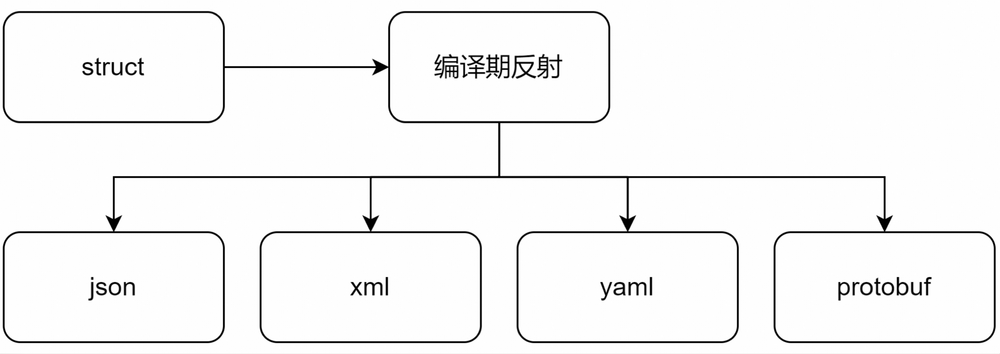

yalantinglibs 的编译期反射库

yalantinglibs的编译期反射库提供了统一的访问对象元数据的API，让编译期反射变得简单，支持的特性也很丰富，使用C++20的时候尤其方便。

# 编译期反射一个对象
从一个简单的例子开始：
```cpp
#include "ylt/reflection/member_value.hpp"

struct simple {
  int color;
  int id;
  std::string str;
  int age;
};

int main() {
  using namespace ylt::reflection;

  // 编译期获取simple 字段个数
  static_assert(member_count_v<simple> == 4);

  // 编译期获取simple 类型的名称
  static_assert(get_struct_name<simple>() == "simple");

  // 编译期获取simple 字段名称列表
  static_assert(get_member_names<simple>() == std::array<std::string_view, 4>{"color", "id", "str", "age"});

  // 根据类型遍历其字段名和索引
  for_each<simple>([](std::string_view field_name) {
    std::cout << field_name << "\n";
  }); 

  for_each<simple>([](std::string_view field_name, size_t index) {
    std::cout << index << ", " << field_name << "\n";
  });
}
```

除了获取这些最基本的对象元数据的API之外，ylt::reflection还提供了更多有用的API：

```cpp
int main() {
  simple p{.color = 2, .id = 10, .str = "hello reflection", .age = 6};

  // 通过编译期索引获取字段值
  CHECK(std::get<0>(p) == 2);
  CHECK(std::get<2>(p) == "hello reflection");

  // 根据编译期索引获取字段名
  static_assert(name_of<simple, 1>()== "id");

  // 根据编译期字段名获取字段值
  CHECK(get<"age"_ylts>(p) == 6);
  CHECK(get<"str"_ylts>(p) == "hello reflection");

  // 根据编译期字段名获取字段索引
  static_assert(index_of<simple2, "str"_ylts>() == 2);

  // 遍历对象的字段、字段名、字段索引, 并打印
  for_each(p, [](auto& field, auto name, auto index) {
    std::cout << field << ", " << name << ", " << index << "\n";
  });

  // 访问对象的所有字段值
  visit_members(p, [](auto&&... args) {
    ((std::cout << args << " "), ...);
    std::cout << "\n";
  });  
}
```

有了这些编译期反射的API之后就可以做一些有趣的事了，比如做序列化，理论上可以通过编译期反射将一个对象序列化到任意格式。事实上yalantinglibs 也是这样做的，通过统一的编译期反射API将对象转换为json，xml，yaml，protobuf等格式。



# 基于编译期反射的序列化
基于yalantinglibs 反射库可以非侵入式的将一个对象序列化到多种数据格式，也可以扩展支持自定义的格式。

```cpp
#include "ylt/struct_json/json_reader.h"
#include "ylt/struct_json/json_writer.h"
#include "ylt/struct_xml/xml_reader.h"
#include "ylt/struct_xml/xml_writer.h"
#include "ylt/struct_yaml/yaml_reader.h"
#include "ylt/struct_yaml/yaml_writer.h"
#include "ylt/struct_pb.hpp"

struct simple {
  int color;
  int id;
  std::string str;
  int age;
};

int main() {
  simple p{.color = 2, .id = 10, .str = "hello reflection", .age = 6};

  std::string json;
  struct_json::to_json(p, json);

  std::string xml;
  struct_xml::to_xml(p, xml);

  std::string yaml;
  struct_yaml::to_yaml(p, yaml);

  std::string protobuf;
  struct_pb::to_pb(p, protobuf);

  simple p1;
  struct_json::from_json(p1, json);
  struct_xml::from_xml(p1, xml);
  struct_yaml::from_yaml(p1, xml);
  struct_pb::from_pb(p1, xml);
}
```

## 使用yalantinglibs reflection 库实现自定义格式的序列化
使用yalantinglibs reflection 库可以很方便的将对象序列化到自定义格式，比如将一个对象序列化成一个简单的json5 格式，json5的key是没有引号的。

只需要通过反射API for_each 拿到对象的字段值和字段名就够了。

```cpp
struct point {
  int x;
  int y;
};

void test_json5() {
  point pt{2, 4};
  std::string json5;
  json5.append("{");
  ylt::reflection::for_each(pt, [&](auto& field, auto name) {
    json5.append(name).append(":").append(std::to_string(field)).append(",");
  });
  json5.back() = '}';
  CHECK(json5 == "{x:2,y:4}");
}
```

# 低版本编译器的支持
前面的example 只能在C++20 高版本编译器(clang13+, gcc11+, msvc2022)中才能编译运行。

如果编译器版本较低只支持C++17 能用yalantinglibs 的反射库吗？

也是可以的，yalantinglibs 的反射库兼容了C++17，支持的最低版本是gcc9，不过需要宏定义一个额外的宏才能使用反射API(C++20 高版本编译器中是不需宏的)，比如之前的例子：

```cpp
struct simple {
  int color;
  int id;
  std::string str;
  int age;
};
YLT_REFL(simple, color, id, str, age);

int main() {
  using namespace ylt::reflection;

  // 编译期获取simple 字段个数
  static_assert(member_count_v<simple> == 4);

  // 编译期获取simple 类型的名称
  static_assert(get_struct_name<simple>() == "simple");

  // 编译期获取simple 字段名称列表
  static_assert(get_member_names<simple>() == std::array<std::string_view, 4>{"color", "id", "str", "age"});

  // 根据类型遍历其字段名和索引
  for_each<simple>([](std::string_view field_name, size_t index) {
    std::cout << index << ", " << field_name << "\n";
  });
}
```
定义了YLT_REFL 宏之后就可以使用反射的API了，如果对象的字段都是私有的，则需要将宏定义到对象内部：
```cpp
struct simple {
YLT_REFL(simple, color, id, str, age);
private:
  int color;
  int id;
  std::string str;
  int age;
};
```
这种方式可以反射私有字段但有侵入性，如果对象有public的访问私有字段的方法也可做到非侵入式：

```cpp
struct dummy_t5 {
 private:
  int id = 42;
  std::string name = "tom";
  int age = 20;

 public:
  int& get_id() { return id; }
  std::string& get_name() { return name; }
  int& get_age() { return age; }

  const int& get_id() const { return id; }
  const std::string& get_name() const { return name; }
  const int& get_age() const { return age; }
};
YLT_REFL(dummy_t5, get_id(), get_name(), get_age());
```

如果对象字段都是私有的，并且没有提供public的访问方法还能反射吗？也是可以的，可以通过yalantinglibs reflection另外一个宏YLT_REFL_PRIVATE非侵入式的反射对象的私有字段：
```cpp
class private_struct {
  int a;
  int b;

 public:
  private_struct(int x, int y) : a(x), b(y) {}
};
YLT_REFL_PRIVATE(private_struct, a, b);
```

现在就可以反射对象的私有字段了：

```cpp
  private_struct st(2, 4);

  for_each(st, [](auto& field, auto name, auto index){
    std::cout << field << ", " << name << ", " << index << "\n";
  });

  visit_members(st, [](auto&... args) {
    ((std::cout << args << " "), ...);
    std::cout << "\n";
  });  
```

# 总结
编译期反射的应用场景很广泛，非常适合用在序列化场景、ORM（实体-映射）场景、非侵入式访问对象等场景，yalantinglibs 的反射库在支持C++20的同时也兼容了C++17，不论是低版本编译器还是高版本编译器，或者对象存在私有字段等场景，都能使用统一的一套易用的API。
