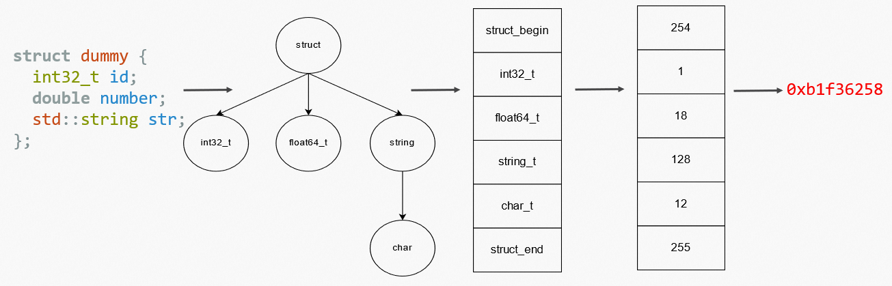

# struct_pack的类型系统


struct_pack的特色是具有一套非侵入式的完备的类型系统。其支持结构体，结构体嵌套，各种基本类型和各种数据结构，同时还支持序列化/反序列化用户自定义的数据结构。下面我们将介绍struct_pack的类型系统。

# struct_pack支持的序列化类型

struct_pack支持的类型主要包括：基本类型，约束类型，复合类型和兼容类型。

## 基本类型

包括：有符号和无符号的定长整数，浮点数，字符，布尔类型和空类型。

下列表格列出了struct_pack支持的所有基本类型：   
| 类型名                    | 含义                        | 编码                  |
| ------------------------- | --------------------------- | ---------------------|
| int8_t                    | 有符号定长8位整数           | 补码                  |
| int16_t                   | 有符号定长16位整数          | 补码                  |
| int32_t                   | 有符号定长32位整数          | 补码                  |
| int64_t                   | 有符号定长64位整数          | 补码                  |
| int128_t(仅GCC/Clang)     | 有符号定长128位整数          | 补码                 |
| uint8_t                   | 无符号定长8位整数           | 原码                  |
| uint16_t                  | 无符号定长16位整数          | 原码                  |
| uint32_t                  | 无符号定长32位整数          | 原码                  |
| uint64_t                  | 无符号定长64位整数          | 原码                  |
| uint128_t(仅GCC/Clang)    | 无符号定长128位整数          | 原码                 |
| struct_pack::var_uint32_t | 无符号变长32位整数          | varint变长编码        |
| struct_pack::var_uint64_t | 无符号变长64位整数          | varint变长编码        |
| struct_pack::var_int32_t  | 有符号变长32位整数          | varint+zigzag变长编码 |
| struct_pack::var_int64_t  | 有符号变长64位整数          | varint+zigzag变长编码 |
| float                     | 定长32位浮点数              | IEEE-754 单精度编码   |
| double                    | 定长64位浮点数               | IEEE-754 双精度编码   |
| char8_t                   | 8位字符                     | 原码                  |
| char16_t                  | 16位字符                    | 原码                  |
| char32_t                  | 32位字符                    | 原码                  |
| wchar_t                   | wchar字符（长度取决于平台） | 原码                   |
| bool                      | 布尔类型                    | 原码                  |
| enum/enum class           | 枚举类型                    | 原码                  |
| std::monostate            | 空类型                      | N/A                  |

## 约束类型

约束类型指：满足了一定约束条件的特定数据结构。只要满足约束条件，无论该数据结构是标准库自带的类，还是第三方库提供的类，都属于相同的约束类型

struct_pack支持以下约束类型：

| 类型名        | 含义                                 | 例如                                                                                                                                |
| ------------- | ------------------------------------ | ----------------------------------------------------------------------------------------------------------------------------------- |
| container     | 顺序容器类型，存储了若干个元素       | std::vector, std::list, std::deque, folly::flat_vector                                                                              |
| set_container | 集合类型，存储了若干个键             | std::set, std::unordered_set, std::multiset, boost::container::flat_set,                                                            |
| map_container | 映射类型，存储了若干键值对           | std::map, std::unordered_map, std::multimap, boost::container::flat_map                                                             |
| string        | 字符串类型                           | std::string, std::string_view, folly::string, boost::container::string, std::wstring, std::u8string, std::u16string, std::u32string |
| array         | 数组类型，其长度编译期确定           | C语言内置数组类型，std::array                                                                                                       |
| optional      | optional类型                         | std::optional, boost::optional                                                                                                      |
| variant       | variant类型                          | std::variant                                                                                                                        |
| expected      | expected类型，包含期望结果或错误码   | std::expected, tl::expected                                                                                                         |
| unique_ptr    | unique_ptr类型，一个独占所有权的指针 | std::unique_ptr                                                                                                                     |
| bitset        | 定长的bit数组，将8个bit压缩为一个bool存储 | std::bitset                                                                                                        |

下面我们列出各类型的详细约束条件, 用户可以根据约束条件来定义自己的数据结构：

### container类型

该类需要提供：`value_type`类型成员和`size()`,`begin()`,`end()`成员函数，同时不满足`set_container`,`map_container`和`string`的约束条件。`value_type`必须也是合法的struct_pack类型。

```cpp
template <typename Type>
concept container = requires(Type container) {
  typename std::remove_cvref_t<Type>::value_type;
  container.size();
  container.begin();
  container.end();
} && !set_container && !map_container && string;
```

如果该类型的内存布局是连续的，struct_pack会启用memcpy优化。

### set_container类型

该类需要提供：`value_type`类型成员和`key_type`类型成员，同时提供`size()`,`begin()`,`end()`成员函数。`value_type`必须也是合法的struct_pack类型。

```cpp
template <typename Type>
concept set_ontainer = requires(Type container) {
  typename std::remove_cvref_t<Type>::value_type;
  typename std::remove_cvref_t<Type>::key_type;
  container.size();
  container.begin();
  container.end();
};
```

### map_container类型

该类需要提供：`value_type`类型成员和`mapped_type`类型成员，同时提供`size()`,`begin()`,`end()`成员函数。`value_type`和`mapped_type`必须也是合法的struct_pack类型。

```cpp
template <typename Type>
concept map_container = requires(Type container) {
  typename std::remove_cvref_t<Type>::value_type;
  typename std::remove_cvref_t<Type>::mapped_type;
  container.size();
  container.begin();
  container.end();
};
```

### string类型

该类需要提供：`value_type`类型成员，且value_type是字符类型，同时提供`size()`,`begin()`,`end()`,`length()`,`data()`成员函数。`value_type`必须也是合法的struct_pack类型。

```cpp

template <typename Type>
concept is_char_t = std::is_same_v<Type, signed char> ||
    std::is_same_v<Type, char> || std::is_same_v<Type, unsigned char> ||
    std::is_same_v<Type, wchar_t> || std::is_same_v<Type, char16_t> ||
    std::is_same_v<Type, char32_t> || std::is_same_v<Type, char8_t>;

template <typename Type>
concept string =  requires(Type container) {
  requires is_char_t<typename std::remove_cvref_t<Type>::value_type>;
  container.size();
  container.begin();
  container.end();
  container.length();
  container.data();
};
```

如果该类型的内存布局是连续的，struct_pack会启用memcpy优化。
如果序列化到string_view类型，struct_pack会启用零拷贝优化。

### array类型

该类型需要满足：是C语言内置数组类型，或者该类型具有`size()`成员函数且特化了`std::tuple_size`。数组的成员必须也是合法的struct_pack类型。

```cpp
template <typename Type>
concept array = std::is_array_v<T> || requires(Type arr) {
  arr.size();
  std::tuple_size<std::remove_cvref_t<Type>>{};
};
```

如果该类型的内存布局是连续的，struct_pack会启用memcpy优化。

### variant类型

该类型只能为std::variant类型，是一个类型安全的union。variant包含的类型必须也是合法的struct_pack类型。

### expected类型

该类需要提供：`value_type`, `error_type`和`unexpected_type`类型成员，同时提供`has_value()`,`error()`,`value()`成员函数。`value_type`和`error_type`必须也是合法的struct_pack类型。

```cpp
template <typename Type>
concept expected = requires(Type e) {
  typename std::remove_cvref_t<Type>::value_type;
  typename std::remove_cvref_t<Type>::error_type;
  typename std::remove_cvref_t<Type>::unexpected_type;
  e.has_value();
  e.error();
  requires std::is_same_v<void,
                          typename std::remove_cvref_t<Type>::value_type> ||
      requires(Type e) {
    e.value();
  };
};
```

该类型序列化的大小取决于`value_type`, `error_type`的最大长度。

### optional类型

该类需要提供：`value_type`类型成员，同时提供`has_value()`,、`value()`成员函数，重载了`operator *`，并且不满足expected类型的约束。`value_type`必须也是合法的struct_pack类型。


```cpp
template <typename Type>
concept optional = !expected<Type> && requires(Type optional) {
  optional.value();
  optional.has_value();
  optional.operator*();
  typename std::remove_cvref_t<Type>::value_type;
};
```

如果该类型为空，struct_pack会对其进行压缩。

### unique_ptr类型

该类需要提供：`operator*`，且禁用了拷贝赋值，同时定义了`element_type`类型成员。

```cpp
template <typename Type>
concept unique_ptr = requires(Type ptr) {
  ptr.operator*();
  typename std::remove_cvref_t<Type>::element_type;
}
&&!requires(Type ptr, Type ptr2) { ptr = ptr2; };
```

如果该对象的值为空指针，struct_pack会对其进行压缩。

### bitset类型

该类需要具有成员函数：`size()`,`flip()`,`set()`,`reset()`,`count()`,并且`size()`函数是constexpr的。该类型的内存布局必须是平凡的，并且将8个bit压缩为一个字节。
```cpp
  template <typename Type>
  concept bitset = requires (Type t){
    t.flip();
    t.set();
    t.reset();
    t.count();
  } && (Type{}.size()+7)/8 == sizeof(Type);
```

## 结构体

struct_pack支持结构体类型。结构体内可以包含最多255个字段，并允许结构体嵌套。结构体中的任何成员都必须是struct_pack的合法类型。

struct_pack的结构体类型可以为：struct/class/std::pair/tuplet::tuple/std::tuple

### 平凡结构体

假如一个结构体类型是`struct/class/std::pair/tuplet::tuple`，且其所有的成员字段都是平凡字段，并且该类型未使用`STRUCT_PACK_REFL`宏注册，则该结构体被视为平凡结构体类型。

平凡字段是下面几种类型中的一种：
1. 基本类型
2. 定长数组类型，且数组的元素类型是平凡结构体
3. `trivial_view<T>` 类型，且T是平凡类型
4. 平凡结构体

平凡结构体的特点是，它的类型信息不但含有各字段的类型信息，还包含了该类型的内存对齐值。


struct_pack认为具有不同对齐的平凡结构体是不同的类型，并可以在反序列化时安全的检查出错误。
例如：

```cpp
#pragma pack(1)
struct foo {
  int a;
  double b;
};
#pragma()
struct bar {
  int a;
  double b;
};
void test() {
  foo f{};
  auto buffer = struct_pack::serialize(f);
  auto result = struct_pack::deserialize<bar>(buffer);
  // foo和 bar是不同的类型，因为其内存对齐不同，导致其内存布局也不同。
  assert(result.has_value() == false);
}
```

需要注意的是，通过`STRUCT_PACK_REFL`宏注册的类型一定不是平凡结构体。
例如：
```cpp
struct foo {
  int a,b,c;
};
struct bar {
  int a,b,c;
};
STRUCT_PACK_REFL(bar,a,b,c);
static_assert(struct_pack::get_type_code<foo>()!=struct_pack::get_type_code<bar>());
```

此外，std::tuple也一定不是平凡结构体。

## 兼容类型

指的是`struct_pack::compatible<T, version_number>`类型，这是一种特殊的类型，从C++语言的角度上看，它和`std::optional`类型类似，但是它在struct_pack语言中的语义十分特殊：表示添加一个可向前/向后兼容的类型。

struct_pack保证对象中新增的`compatible<T, version_number>`字段，序列化后的二进制数据可以被安全的反序列化为旧版本的对象，多余的数据会被舍弃。

struct_pack同样保证旧版本的对象，序列化后的二进制数据可以被安全的反序列化为添加了`compatible<T, version_number>`字段的新版本对象。这些新字段反序列化的结果将是空值（`std::nullopt`）。

默认的version_number为0。

例如，我们定义一个新版本的`person`：

```cpp
struct person_v2 {
  int age;
  std::string name;
  struct_pack::compatible<std::string> nick_name;
};
```

我们可以保证其向前兼容性：

```cpp
auto buffer = struct_pack::serialize(person_v2{.age=24,.name="Betty",.nick_name="NULL"});
auto res = struct_pack::deserialize<person>(buffer);

assert(res.has_value()==true);
assert(res->age==24);
assert(res->name=="Betty");
```

也可以保证其向后兼容性

```cpp
auto buffer = struct_pack::serialize(person{.age=24,.name="Betty"});
auto res = struct_pack::deserialize<person_v2>(buffer);

assert(res.has_value()==true);
assert(res->age==24);
assert(res->name=="Betty");
assert(res->nick_name.has_value()==false);
```

注意：`struct_pack::compatible<T>`中包含的类型`T`必须是一个合法的struct_pack类型。

注意，在修改字段的过程中，如果想保证兼容性，必须遵循只增不改原则：

1. 只增：新添加的字段必须是`struct_pack::compatible<T, version_number>`类型，且version_number必须大于上一次填入的版本号。
2. 不改：不修改/删除任何一个旧的字段。

如果删去/修改了旧的`struct_pack::compatible<T, version_number>`类型，或者新增的`struct_pack::compatible<T, version_number>`类型版本号不是递增的，则两个结构体不能相互兼容，并且在两个不同版本之间序列化/反序列化的行为是**未定义**的！

# struct_pack的类型信息和类型哈希

## 类型哈希校验

struct_pack的类型校验依赖于编译期获取的类型信息，并在编译期执行哈希计算，从而得到用于校验的类型哈希码。

struct_pack计算类型哈希的步骤如下：

1. 通过静态反射，从待序列化的类型生成一棵struct_pack类型树。
2. 在编译期递归遍历这颗树，生成与类型树对应的类型字符串。
3. 在编译期计算字符串的32位MD5哈希值。

如下图所示：



对于结构体
```
struct dummy {
  int32_t id;
  double number;
  std::string str;
};
```

其最外层是一个结构体，结构体作为类型树的根节点，包含了三个子成员：`id`，`number`和`str`。前两者是基本类型，因此是类型树的叶子节点。后者是`string`约束类型，其包含的子类型是`char`，因此有一个`char`类型的子节点。

每个不同的类型都有独一无二的类型`id`。生成对应的类型树后，我们可以在编译期遍历这棵树，然后根据类型`id`得到唯一映射了类型树的字符串，最后在编译期计算该字符串的32位MD5哈希值，即可得到该类型的哈希校验码。

该校验码将会被保存到struct_pack序列化数据的头部，在反序列化时，我们会首先读取数据中的校验码是否和待反序列化的类型相同。由于类型计算在编译期完成，因此无论其有多么复杂，运行时都只需要简单的对一个32位的整数进行比较即可，这无疑是非常高效的。

一旦检查到哈希校验码不符合预期，struct_pack都会返回一个错误码：`struct_pack::errc::invalid_argument`。

## 兼容性问题

struct_pack允许用户给旧版本的结构体添加`struct_pack::compatible<T>`字段。为了保证兼容性，我们的类型校验必须跳过这一字段。具体的来说，我们在生成类型字符串的过程中会略去类型树中根节点为`struct_compatible<T>`类型的子树。这样就保证其哈希码和旧版本的结构体相同。

## 哈希冲突

struct_pack使用的32位MD5哈希值（由于最低位被struct_pack用于存储其他信息，有效位数只有31位），完全可能被构造出哈希冲突。反序列化时，如果发生哈希冲突，struct_pack的行为是未定义的。但是这一概率很低，不考虑恶意构造的情况下，随机写一个错误的类型，反序列化到该类型且发生哈希冲突的概率是2的负-31次方。考虑到写错类型的概率本来就很低，因此哈希冲突应该是很罕见的行为。

为了缓解哈希冲突，struct_pack默认情况下会在debug模式中给序列化数据添加完整的类型字符串并进行完整的校验。因此，只要用户在debug模式中测试过自己的代码，即使不小心写错了类型，并且极其倒霉的发生了哈希冲突，也能在debug模式下被检测出来。

综上，struct_pack具有高效且安全的类型校验能力。
